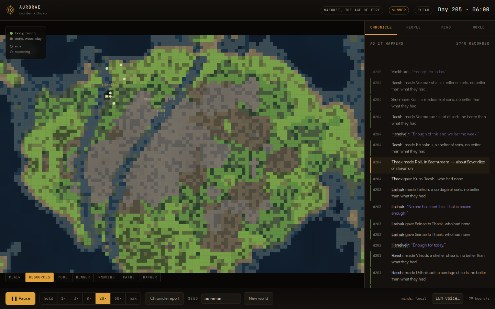

# Aurorae

An observatory for an open-ended world.

A handful of people wake on an unnamed shore with no knowledge, no words for
things, and no plan. They get hungry, cold, curious and attached. Everything
after that — the tools, the shelters, the language, the trade, the rules they
hold each other to, the graves — is theirs. Nothing is scripted, there is no
tech tree, and no outcome is guaranteed. Some worlds flourish. Some starve.

You watch. When you pause, you get a chronicle of what happened and why.



---

## Run it

The project uses native ES modules, so it must be served over HTTP — opening
`index.html` from the filesystem will not work.

```bash
python3 -m http.server 5000
# then open http://localhost:5000
```

No build step, no dependencies, no bundler. Any static host works, including
GitHub Pages:

1. Push to `main`.
2. Settings → Pages → Source: *Deploy from a branch* → `main` / `/ (root)`.
3. The site appears at `https://<user>.github.io/<repo>/`.

Node 18+ is only needed for the optional tools in `tools/`.

---

## Controls

| Key       | Does                                       |
| --------- | ------------------------------------------ |
| `Space`   | Pause / resume (pausing opens the report)  |
| `0`–`6`   | Speed: hold, 1×, 3×, 8×, 20×, 60×, max     |
| `r`       | Open the chronicle report                  |
| `o`       | Cycle map overlays                         |
| `Esc`     | Close the report                           |

Click anyone on the map or in **People** to open their mind. Click a name in the
feed to jump to them. The **seed** field is the world's DNA — the same seed
always grows the same world, so you can share one or re-roll for a new history.

Map overlays: terrain, resources, mood, hunger, knowledge, worn paths, danger.

One tick is one world hour. At `max` the simulation runs as fast as the frame
budget allows (typically thousands of hours per second early on, slowing as the
population and its knowledge grow).

---

## What is actually being simulated

**A world, not a board.** Height, moisture and fertility make terrain; terrain
decides where plants, stone, clay, ore, wood, game and water sit. Resources
regrow at their own rate and can be exhausted. Seasons turn, weather rolls
through, nights are cold and dark, and winter is genuinely dangerous.

**Bodies.** Energy, hunger, thirst, warmth, rest, health, illness, injury,
pregnancy. Bodies fail. Death has causes — starvation, cold, exhaustion,
sickness, injury, violence, old age — and the cause is recorded.

**Minds that deliberate.** Each hour an agent generates candidate actions,
scores each one against its needs, feelings, traits, skills, memories and
beliefs, and picks the best. The scores and the reason for each are kept, so the
**Mind** panel shows you the actual deliberation: what it considered, what it
scored, and why it chose what it chose. There is no state machine and no
behaviour tree.

**Emotions.** Fourteen of them, appraised from what happens rather than
assigned: joy, grief, fear, anger, shame, pride, affection, envy, curiosity,
disgust, hope, loneliness, gratitude, awe. They decay, they colour decisions,
and they shape memory.

**Memory that keeps things.** Every interaction is appraised for salience.
Anything strong enough goes into a permanent core that is never pruned — so a
betrayal or a kindness from year two still shapes behaviour in year nine.
Weaker episodes fade and consolidate into semantic knowledge and beliefs.
Relationships are per-person and cumulative: affection, trust, kinship,
exchanges, conflicts.

**Open-ended invention.** This is the part with no ceiling. There is no recipe
list. An agent combines things it has, applies a process it knows (striking,
binding, heating, grinding, weaving, fermenting, sharpening…) and gets a *new
object* with emergent properties derived from its ingredients. The world then
judges it: is it better than anything else they have for cutting, carrying,
holding heat, keeping warm? Good results spread by teaching and imitation, get
names in their language, and become the basis of the next attempt. Most attempts
are dead ends. Capability is measured, not unlocked, and eras are named after
what they can actually do.

**Knowledge can be lost.** If the only person who knows how to make something
dies, it is gone — and the report tells you what went with them.

**Language.** They generate their own words, with their own phonology, for
things they care about. Words drift across generations. The settlement and the
language have names they made up.

**Society.** Courtship, bonding, birth, child-rearing, orphans, elders.
Teaching, gifts, theft, conflict, tending the sick. Trade with prices that
emerge from scarcity and demand rather than a price table. Specialisation into
roles the simulation did not define in advance. Norms that arise from repeated
behaviour, get upheld or violated, and occasionally harden into laws. Rituals at
named sites. Art. Beliefs.

**Death handled properly.** Corpses lie where they fall until someone carries
them to a grave field they opened and named. Mourning changes the mourners.
Heirs take what was left. Lineages continue or end.

---

## The report

Hit pause. The chronicle is written from the record, not templated over it:

- A narrative of the stretch you just watched, in plain language
- Where things stand: population, capability, knowledge, mood, inequality
- Charts: population and food, births and deaths, capability and breadth, mood and health
- The people: ages, roles, who is respected, closest bonds
- Those who did not make it, and why
- What they figured out: best answer to each need, what is newly made, what was lost with the dead, which processes they now know
- What they trade and what it costs
- Their culture: rules, language drift, rites, beliefs
- Notable lives, as short biographies with milestones
- The ages of the world, and the turning points
- Since you last looked

If everyone dies, the report opens by itself.

---

## Optional: give them a voice with an LLM

The simulation is complete without this. If you switch it on, an LLM is handed a
snapshot of one agent's body, feelings, current deliberation, memories and
relationships, and writes their inner monologue in first person. It narrates;
it never decides. Click **LLM voice…**, choose OpenAI, Anthropic or a local
Ollama, paste a key. The key lives in your browser's `localStorage` and is never
committed. Requests are throttled and the bridge disables itself after repeated
errors.

Because a browser calls the API directly, use a key you are comfortable exposing
to your own machine, or point it at Ollama and keep everything local.

---

## Architecture

```
index.html            markup and shell
css/base.css          tokens, fonts, resets
css/app.css           layout, panels, report
src/main.js           loop, speed, input, wiring
src/core/rng.js       seeded deterministic RNG
src/core/util.js      small helpers
src/core/language.js  phonology, word coinage, drift
src/world/world.js    terrain, resources, seasons, weather, spatial index
src/sim/genome.js     traits and inheritance
src/sim/emotion.js    appraisal and the 14 emotions
src/sim/memory.js     core vs episodic memory, recall, consolidation
src/sim/concepts.js   ontology, processes, invention, evaluation, loss
src/sim/mind.js       candidate generation, utility, deliberation
src/sim/actions.js    what actions actually do to the world
src/sim/agent.js      the person
src/sim/sim.js        the tick: bodies, society, trade, norms, birth, death
src/sim/chronicle.js  the historian and the report
src/ui/render.js      canvas map and overlays
src/ui/panels.js      feed, roster, mind, world panes
src/ui/charts.js      sparklines and line charts
src/ui/report.js      the report sheet
src/llm/bridge.js     optional LLM voice
tools/                headless runs, multi-seed sweeps, profiling
```

Everything is deterministic given a seed. The renderer and the UI only read
simulation state; the simulation never reads them, so it runs headless too:

```bash
node tools/headless-test.mjs 12000        # one world, 12000 hours
node tools/sweep.mjs 15000 1,2,3,4,5,6    # survival across seeds
node tools/perf.mjs                       # ticks per second
```

---

## Things worth knowing

- **Boom and bust is real.** Populations often peak, overrun their food, and
  crash — usually with children dying first. It is not a bug, it is what the
  numbers do. Some seeds recover into something stable. Some do not.
- **Every seed is a different history.** If a world dies young, take the report
  and try another.
- **Nothing is unlocked.** If they never figure out how to hold heat, they never
  get an age of fire.

